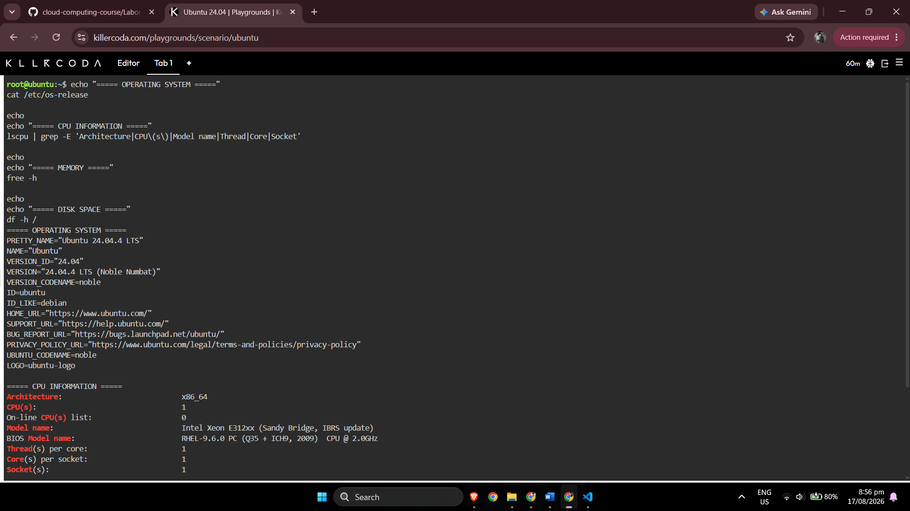
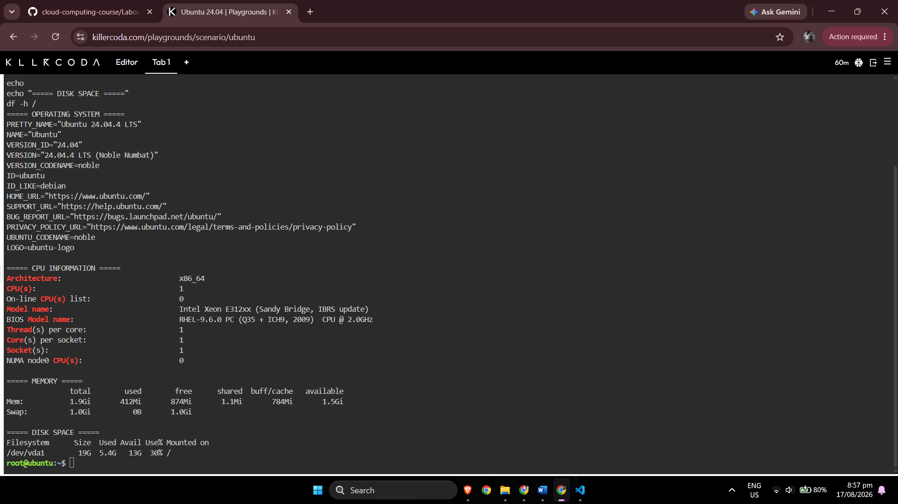

# Linux Investigation

## Commands Used

### Operating System

```bash
cat /etc/os-release
```

### CPU Information

```bash
lscpu
```

### Memory

```bash
free -h
```

### Disk Space

```bash
df -h /
```

---

# Linux Server Information

**Operating System**
```text
PRETTY_NAME="Ubuntu 24.04.4 LTS"
NAME="Ubuntu"
VERSION_ID="24.04"
VERSION="24.04.4 LTS (Noble Numbat)"
VERSION_CODENAME=noble
```

**CPU Information**
```text
PRETTY_NAME="Ubuntu 24.04.4 LTS"
NAME="Ubuntu"
VERSION_ID="24.04"
VERSION="24.04.4 LTS (Noble Numbat)"
VERSION_CODENAME=noble
```

**Memory** 
```text
               total        used        free      shared  buff/cache   available
Mem:           1.9Gi       412Mi       874Mi       1.1Mi       784Mi       1.5Gi
Swap:          1.0Gi          0B       1.0Gi
```

**Disk Space**
```text
Filesystem      Size  Used Avail Use% Mounted on
/dev/vda1        19G  5.4G   13G  30% /
```

---

# Terminal Evidence

The following screenshot shows the KillerCoda terminal output used to identify the Linux operating system, processor information, memory, and filesystem capacity.




---

# Cloud Migration Recommendation

If this Linux server were migrated into a public cloud environment, each of the three cloud providers has an Infrastructure as a Service virtual-machine product capable of hosting a Linux operating system.

| Cloud Provider | Service That Could Host the Linux Server | Reason |
|---|---|---|
| **AWS** | Amazon EC2 | EC2 provides configurable virtual computing instances and supports Linux-based server workloads. |
| **Microsoft Azure** | Azure Virtual Machines | Azure Virtual Machines can provide scalable Linux virtual machines with configurable CPU, memory, disk, and networking. |
| **Google Cloud** | Compute Engine | Compute Engine provides virtual machines running on Google Cloud infrastructure and supports Linux workloads. |

## Migration Analysis

For **AWS**, the Linux server could be recreated or migrated to an **Amazon EC2 instance** with an instance type selected according to the CPU and memory requirements discovered in KillerCoda. Storage could be attached using appropriate EC2 storage options while networking could be configured inside an Amazon VPC.

For **Microsoft Azure**, the server could run on an **Azure Virtual Machine**. A VM size could be selected according to the required virtual CPUs and memory, and Azure networking and storage services could then be configured for the migrated workload.

For **Google Cloud**, the server could run using **Compute Engine**. The required machine configuration could be selected according to CPU, memory, operating-system, storage, and application requirements.

Therefore, all three providers are technically capable of hosting the investigated Linux server. The final choice would depend on application dependencies, required performance, pricing, networking, management tools, organizational skills, and other business requirements rather than the operating system alone.

---

# References

1. KillerCoda. **Interactive Environments**.  
   https://killercoda.com/

2. freedesktop.org. **os-release – Operating System Identification**.  
   https://www.freedesktop.org/software/systemd/man/os-release.html

3. Linux Manual Pages. **lscpu(1) – Display CPU Architecture Information**.  
   https://man7.org/linux/man-pages/man1/lscpu.1.html

4. Linux Manual Pages. **free(1) – Display Memory Information**.  
   https://man7.org/linux/man-pages/man1/free.1.html

5. Linux Manual Pages. **df(1) – Report File System Space Usage**.  
   https://man7.org/linux/man-pages/man1/df.1.html

6. AWS Documentation. **What is Amazon EC2?**  
   https://docs.aws.amazon.com/AWSEC2/latest/UserGuide/concepts.html

7. Microsoft Azure. **Azure Virtual Machines**.  
   https://azure.microsoft.com/en-us/products/virtual-machines

8. Google Cloud Documentation. **Compute Engine Documentation**.  
   https://docs.cloud.google.com/compute/docs