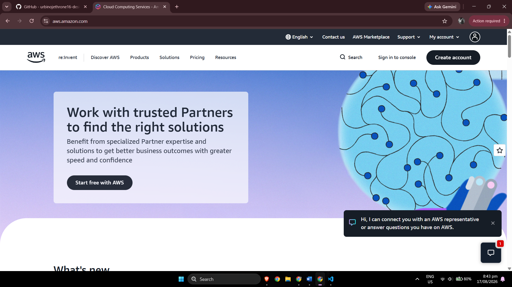

# Amazon Web Services (AWS) Research

## Brief Overview

Amazon Web Services (AWS) is a public cloud computing platform provided by Amazon. It offers cloud-based infrastructure and managed services that organizations can use without purchasing and maintaining all of their own physical servers. AWS supports workloads ranging from simple websites and mobile applications to enterprise systems, databases, analytics, artificial intelligence, and large-scale distributed applications.

AWS began providing major cloud infrastructure services in 2006 with the launch of Amazon Simple Storage Service (Amazon S3), followed by Amazon Elastic Compute Cloud (Amazon EC2).

---

## Global Infrastructure

AWS organizes its global infrastructure primarily into **Regions** and **Availability Zones (AZs)**.

- A **Region** is a geographic location where AWS operates infrastructure.
- An **Availability Zone** is an isolated infrastructure location within a Region.
- Organizations can distribute workloads across multiple Availability Zones to improve availability and fault tolerance.
- AWS also operates edge infrastructure that can help deliver services and content closer to end users.

This structure allows companies to select deployment locations based on latency, availability, compliance, disaster recovery, and business requirements.

---

## Cloud Management Console

AWS provides the **AWS Management Console**, a web-based graphical interface for accessing and managing AWS services.

Through the console, administrators and developers can:

- Create virtual machines.
- Configure storage.
- Create virtual networks.
- Manage user permissions.
- Monitor cloud resources.
- Configure databases and application services.

AWS resources can also be managed using the AWS Command Line Interface, SDKs, APIs, and infrastructure-as-code tools.

---

## Four Core AWS Services

| Service | Category | Description |
|---|---|---|
| **Amazon EC2** | Compute | Provides configurable virtual servers that can run applications and operating systems in the AWS Cloud. |
| **Amazon S3** | Storage | Provides scalable object storage for files, backups, application assets, data lakes, and other objects. |
| **Amazon VPC** | Networking | Allows organizations to create logically isolated virtual networks for AWS resources. |
| **AWS IAM** | Identity and Security | Controls authentication, authorization, users, roles, and permissions for AWS resources. |

### 1. Amazon EC2

Amazon Elastic Compute Cloud (EC2) provides on-demand virtual computing capacity. Organizations can choose different instance types according to CPU, memory, storage, and workload requirements.

### 2. Amazon S3

Amazon Simple Storage Service (S3) is an object storage service. It is commonly used for application files, media, backups, archives, analytics datasets, and static website assets.

### 3. Amazon VPC

Amazon Virtual Private Cloud (VPC) provides a logically isolated network. Administrators can configure IP address ranges, subnets, routes, gateways, and security controls.

### 4. AWS Identity and Access Management

AWS Identity and Access Management (IAM) controls who can access AWS resources and which actions they are permitted to perform. IAM supports users, groups, roles, and permission policies.

---

## Three Advantages of AWS

### 1. Large Service Portfolio

AWS provides services across computing, storage, networking, databases, analytics, artificial intelligence, security, serverless computing, containers, Internet of Things, and many other technology areas.

### 2. Flexible Scalability

Organizations can increase or decrease cloud resources according to application demand instead of permanently purchasing enough physical hardware for peak usage.

### 3. Mature Global Cloud Ecosystem

AWS has extensive infrastructure, documentation, training resources, partner solutions, and cloud management technologies that support small applications as well as enterprise workloads.

---

## Typical Enterprise Use Cases

AWS can be used for:

- Hosting enterprise websites and APIs.
- Running virtual servers.
- Deploying globally available e-commerce applications.
- Backup and disaster recovery.
- Object and archival storage.
- Managed databases.
- Data analytics.
- Machine learning.
- Containerized applications.
- Development and testing environments.
- Content delivery.
- Serverless application architectures.

---

## Evidence

The following screenshot shows the official Amazon Web Services website used during this investigation.

---

## Key Observation

AWS is suitable when an organization needs a broad cloud service portfolio and the flexibility to combine many infrastructure and managed services. Its large ecosystem makes it applicable to startups, enterprise systems, global applications, data workloads, and cloud-native architectures.

---

## References

1. Amazon Web Services. **AWS Official Website**.  
   https://aws.amazon.com/

2. Amazon Web Services. **AWS Global Infrastructure**.  
   https://aws.amazon.com/about-aws/global-infrastructure/

3. Amazon Web Services. **Our Origins**.  
   https://aws.amazon.com/about-aws/our-origins/

4. AWS Documentation. **What is Amazon EC2?**  
   https://docs.aws.amazon.com/AWSEC2/latest/UserGuide/concepts.html

5. Amazon Web Services. **Amazon S3**.  
   https://aws.amazon.com/s3/

6. AWS Documentation. **What is Amazon VPC?**  
   https://docs.aws.amazon.com/vpc/latest/userguide/what-is-amazon-vpc.html

7. AWS Documentation. **What is IAM?**  
   https://docs.aws.amazon.com/IAM/latest/UserGuide/introduction.html