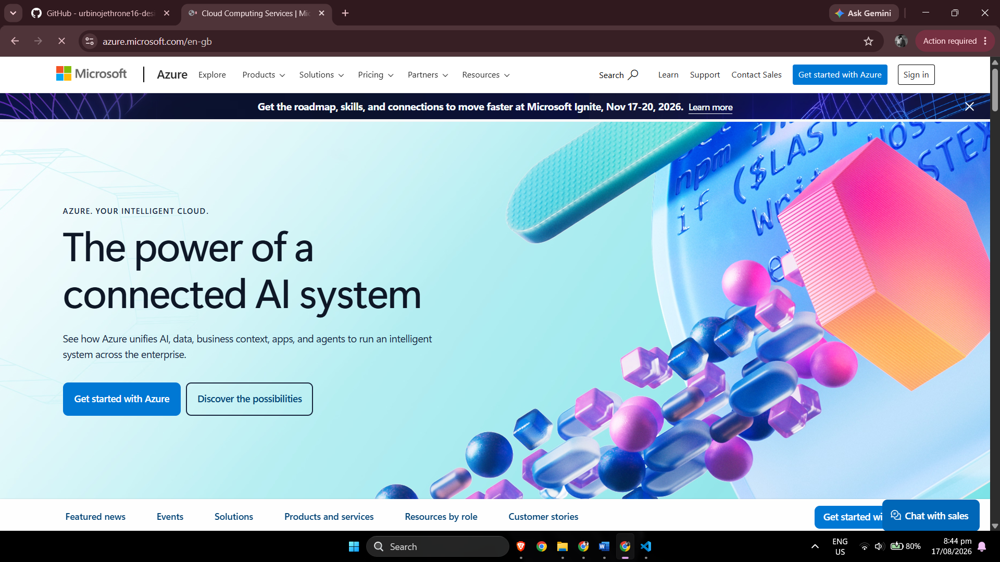

# Microsoft Azure Research

## Brief Overview

Microsoft Azure is Microsoft's public cloud computing platform. It provides infrastructure, platform, database, networking, identity, analytics, artificial intelligence, and application services through Microsoft's global cloud infrastructure.

Azure is especially important in enterprise environments because organizations that already use technologies such as Windows Server, Microsoft 365, SQL Server, and Microsoft identity technologies can connect existing systems with cloud services.

Microsoft Azure became commercially available in 2010.

---

## Global Infrastructure

Microsoft Azure operates cloud infrastructure through geographically distributed **Regions** and **Availability Zones**.

- An **Azure Region** represents infrastructure deployed within a geographic area.
- **Availability Zones** are physically separate infrastructure locations within supported Azure regions.
- Multiple zones can be used to improve application resiliency.
- Microsoft also groups cloud locations according to geographic and data-residency requirements.

Organizations can select regions based on factors such as application latency, business continuity, data residency, compliance, and service availability.

---

## Cloud Management Console

Azure resources are commonly managed using the **Azure portal**.

The Azure portal allows users to:

- Create virtual machines.
- Configure networks.
- Manage storage accounts.
- Configure databases.
- Monitor applications.
- Manage subscriptions and resource groups.
- Configure Microsoft Entra identities and permissions.

Azure resources can additionally be administered with Azure CLI, Azure PowerShell, APIs, templates, and infrastructure-as-code technologies.

---

## Four Core Azure Services

| Service | Category | Description |
|---|---|---|
| **Azure Virtual Machines** | Compute | Provides scalable Windows and Linux virtual machines in Microsoft Azure. |
| **Azure Blob Storage** | Storage | Microsoft's cloud object storage service for large amounts of unstructured data. |
| **Azure Virtual Network** | Networking | Provides private networking for Azure resources and connectivity with external networks. |
| **Microsoft Entra ID** | Identity and Security | Provides cloud-based identity and access management. |

### 1. Azure Virtual Machines

Azure Virtual Machines provides Infrastructure as a Service computing. Organizations can create Linux or Windows virtual servers and choose hardware configurations according to workload requirements.

### 2. Azure Blob Storage

Azure Blob Storage is Microsoft's object storage solution. It can store documents, application assets, backups, media, logs, archives, and other unstructured data.

### 3. Azure Virtual Network

Azure Virtual Network provides private networking for Azure resources. It supports subnets, routing, network security, connectivity to other virtual networks, and connectivity to on-premises infrastructure.

### 4. Microsoft Entra ID

Microsoft Entra ID is a cloud-based identity and access management service. It provides authentication and access control for users, applications, devices, and cloud resources.

---

## Three Advantages of Microsoft Azure

### 1. Microsoft Ecosystem Integration

Azure works closely with Microsoft's enterprise technologies, making it a strong option for organizations that already depend on Windows Server, Microsoft 365, SQL Server, and Microsoft identity technologies.

### 2. Hybrid Cloud Capabilities

Azure provides technologies that allow organizations to connect existing on-premises infrastructure with cloud resources instead of requiring every workload to be moved at once.

### 3. Enterprise-Focused Services

Azure provides extensive options for enterprise computing, security, database management, application modernization, identity, analytics, and administration.

---

## Typical Enterprise Use Cases

Azure can be used for:

- Migrating Windows Server workloads.
- Running Linux and Windows virtual machines.
- Extending on-premises infrastructure into the cloud.
- Microsoft identity integration.
- Hosting web applications.
- SQL databases.
- Backup and disaster recovery.
- Artificial intelligence solutions.
- Data analytics.
- Containerized workloads.
- Enterprise application modernization.
- Development and testing environments.

---

## Evidence

The following screenshot shows the official Microsoft Azure website examined during this activity.

---

## Key Observation

Azure is particularly attractive for organizations that already operate Microsoft-based environments. Instead of replacing existing Microsoft systems completely, an organization can use Azure to extend, migrate, and modernize those systems using cloud infrastructure and managed services.

---

## References

1. Microsoft. **Microsoft Azure Official Website**.  
   https://azure.microsoft.com/

2. Microsoft. **What is Azure?**  
   https://azure.microsoft.com/en-us/resources/cloud-computing-dictionary/what-is-azure

3. Microsoft Learn. **Azure Regions List**.  
   https://learn.microsoft.com/en-us/azure/reliability/regions-list

4. Microsoft Azure. **Azure Virtual Machines**.  
   https://azure.microsoft.com/en-us/products/virtual-machines

5. Microsoft Learn. **What is Azure Blob Storage?**  
   https://learn.microsoft.com/en-us/azure/storage/blobs/storage-blobs-overview

6. Microsoft Learn. **What is Azure Virtual Network?**  
   https://learn.microsoft.com/en-us/azure/virtual-network/virtual-networks-overview

7. Microsoft Learn. **Microsoft Entra Product Family**.  
   https://learn.microsoft.com/en-us/entra/fundamentals/what-is-entra