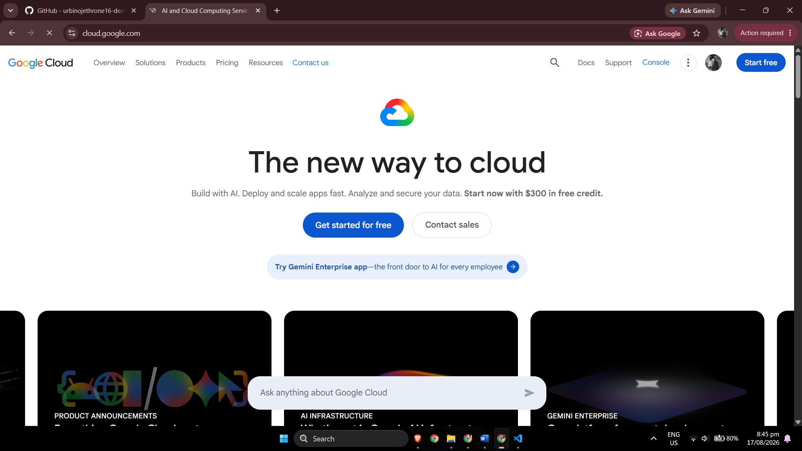

# Google Cloud Platform (GCP) Research

## Brief Overview

Google Cloud is Google's public cloud computing platform. It provides infrastructure and managed services for computing, storage, networking, databases, data analytics, artificial intelligence, machine learning, Kubernetes, and application development.

Google's cloud history includes the launch of Google App Engine in 2008. Today, Google Cloud supports traditional virtual-machine workloads as well as modern containerized, serverless, analytics, and artificial intelligence applications.

---

## Global Infrastructure

Google Cloud organizes its infrastructure through **Regions** and **Zones**.

- A **Region** is an independent geographic area where Google Cloud operates infrastructure.
- A **Zone** is a deployment area inside a region.
- Applications can use multiple zones to improve availability.
- Google operates a global network connecting its cloud infrastructure.

This design allows organizations to select locations according to latency, availability, business-continuity, and data-location requirements.

---

## Cloud Management Console

Google Cloud provides the **Google Cloud console**, a web interface used to configure and manage Google Cloud resources.

The console can be used to:

- Create Compute Engine virtual machines.
- Configure Cloud Storage.
- Manage VPC networks.
- Create Kubernetes clusters.
- Configure IAM permissions.
- Create and manage databases.
- Monitor cloud applications.
- Manage artificial intelligence and machine learning resources.

Google Cloud resources can also be administered using the `gcloud` CLI, APIs, SDKs, and infrastructure-as-code tools.

---

## Four Core Google Cloud Services

| Service | Category | Description |
|---|---|---|
| **Compute Engine** | Compute | Provides virtual machines that run using Google's cloud infrastructure. |
| **Cloud Storage** | Storage | Provides object storage for application data, files, backups, archives, and datasets. |
| **Virtual Private Cloud (VPC)** | Networking | Provides global virtual networking functionality for Google Cloud resources. |
| **Identity and Access Management (IAM)** | Identity and Security | Controls who can perform specific actions on Google Cloud resources. |

### 1. Compute Engine

Compute Engine allows users to create and run virtual machines on Google infrastructure. It supports a variety of machine configurations and can be used for application hosting, development environments, enterprise workloads, and high-performance computing.

### 2. Cloud Storage

Cloud Storage provides object storage for data that needs to be stored and retrieved through Google Cloud. Common uses include backups, application files, media, archives, analytics data, and AI/ML datasets.

### 3. Virtual Private Cloud

Google Cloud VPC provides networking for virtual machines, Kubernetes workloads, and other cloud services. A VPC network can contain regional subnetworks connected through Google's network.

### 4. Identity and Access Management

Google Cloud IAM provides fine-grained authorization. Administrators can grant roles to users, groups, service accounts, and other principals to control access to cloud resources.

---

## Three Advantages of Google Cloud

### 1. Strong Data and Artificial Intelligence Platform

Google Cloud provides integrated technologies for analytics, machine learning, artificial intelligence, large-scale data processing, and generative AI.

### 2. Kubernetes Expertise

Google Cloud provides Google Kubernetes Engine (GKE), a managed Kubernetes platform. Kubernetes itself originated from Google's experience operating large-scale containerized systems.

### 3. Global Networking

Google Cloud's VPC design and global network provide organizations with flexible networking for applications distributed across geographic locations.

---

## Typical Enterprise Use Cases

Google Cloud can be used for:

- Artificial intelligence and machine learning.
- Large-scale data analytics.
- Kubernetes workloads.
- Cloud-native applications.
- Virtual-machine hosting.
- Mobile and web application backends.
- Object storage and backups.
- Managed databases.
- High-performance computing.
- Data science environments.
- Serverless applications.
- Globally distributed applications.

---

## Evidence

The following screenshot shows the official Google Cloud homepage examined during this investigation.

---

## Key Observation

Google Cloud stands out when an organization places a strong emphasis on data engineering, artificial intelligence, machine learning, Kubernetes, and modern application development. Its services can support projects ranging from individual virtual machines to globally distributed AI and container platforms.

---

## References

1. Google Cloud. **Google Cloud Official Website**.  
   https://cloud.google.com/

2. Google Cloud. **Global Locations – Regions and Zones**.  
   https://cloud.google.com/about/locations

3. Google Cloud Documentation. **Compute Engine Documentation**.  
   https://docs.cloud.google.com/compute/docs

4. Google Cloud Documentation. **Cloud Storage Documentation**.  
   https://docs.cloud.google.com/storage/docs

5. Google Cloud Documentation. **Virtual Private Cloud Overview**.  
   https://docs.cloud.google.com/vpc/docs/overview

6. Google Cloud Documentation. **IAM Overview**.  
   https://docs.cloud.google.com/iam/docs/overview

7. Google Cloud Documentation. **Google Kubernetes Engine Overview**.  
   https://docs.cloud.google.com/kubernetes-engine/docs/concepts/kubernetes-engine-overview

8. Google Cloud. **Vertex AI Documentation**.  
   https://cloud.google.com/vertex-ai/docs

9. Google Cloud Blog. **Reflecting on Our Ten Year App Engine Journey**.  
   https://cloud.google.com/blog/products/gcp/reflecting-on-our-ten-year-app-engine-journey